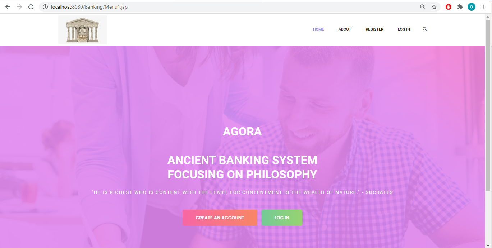
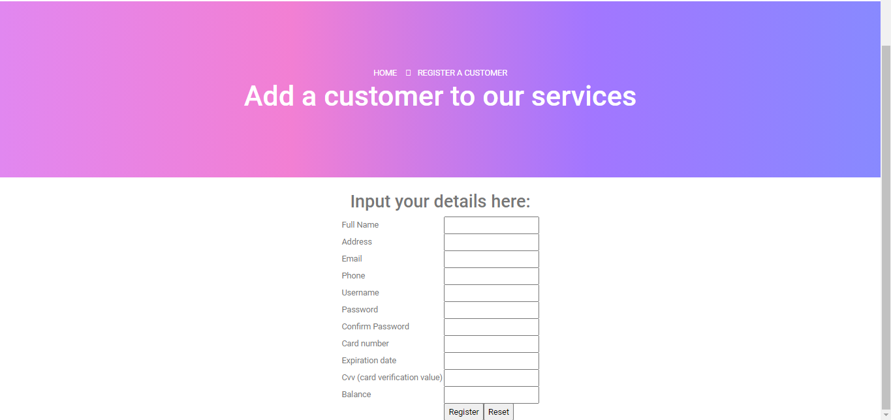
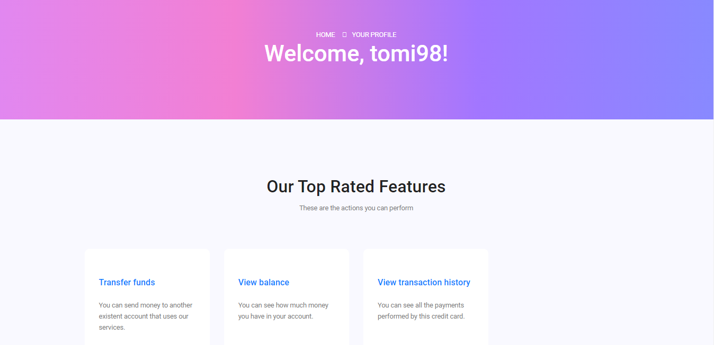

#Banking System Web Application 

The project was written in Java mainly, the web page was generated using Java Servlets and Apache Tomcat, and CSS was used to style the HTML Document.

There are mainly basic functionalities, like Admin and User registration and login, payment making between accounts, generating reports, enquiring balances.

Home Screen:

Admin Register Screen:

User page:

